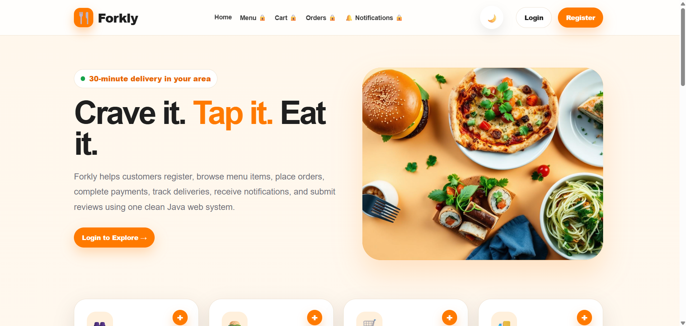
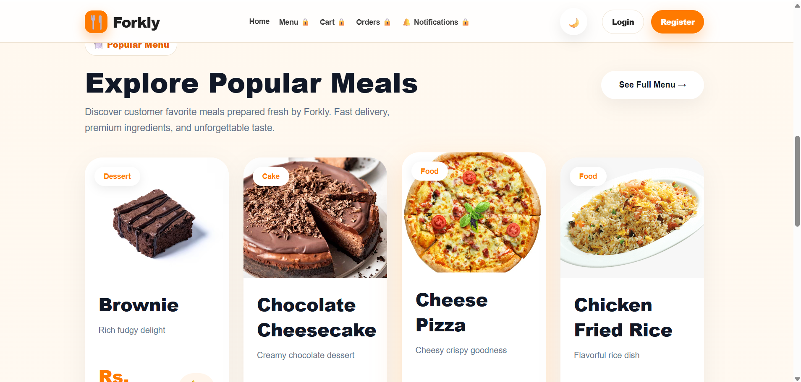
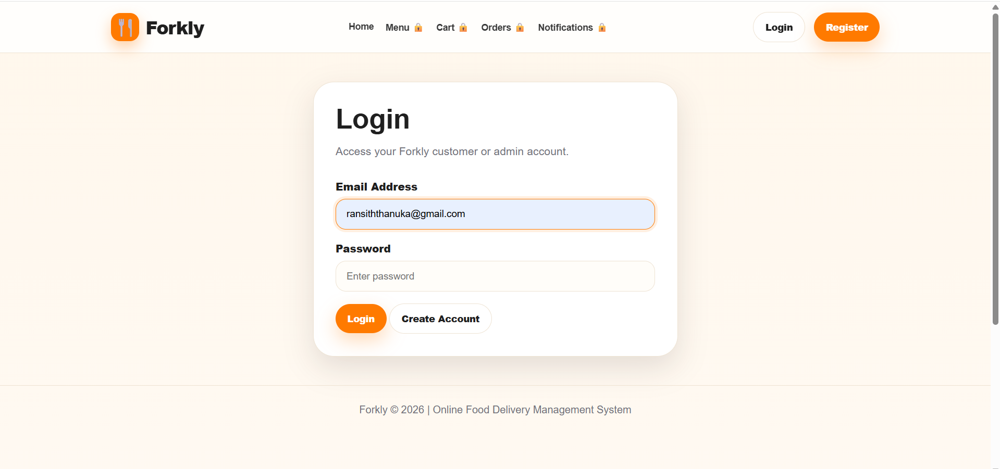
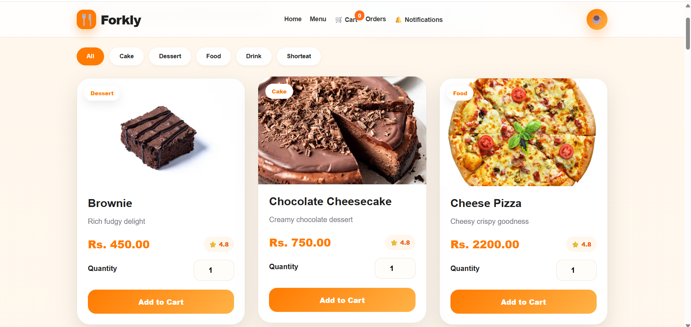
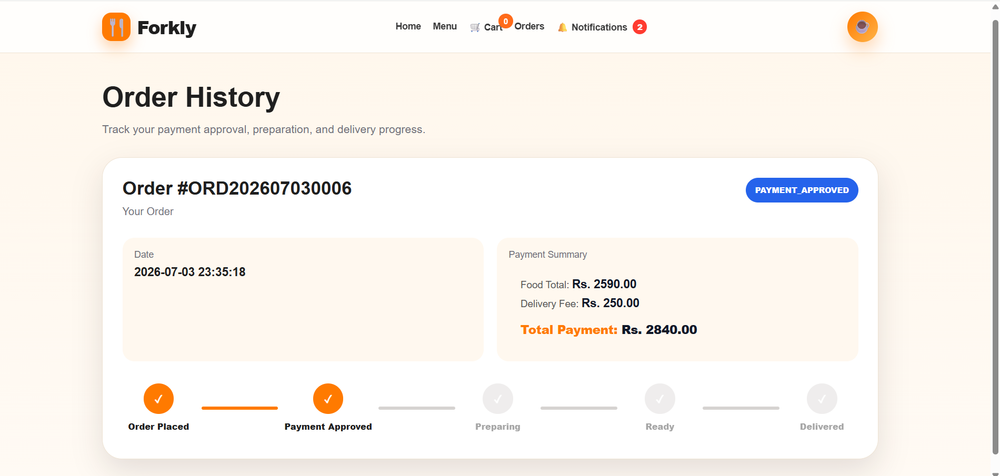
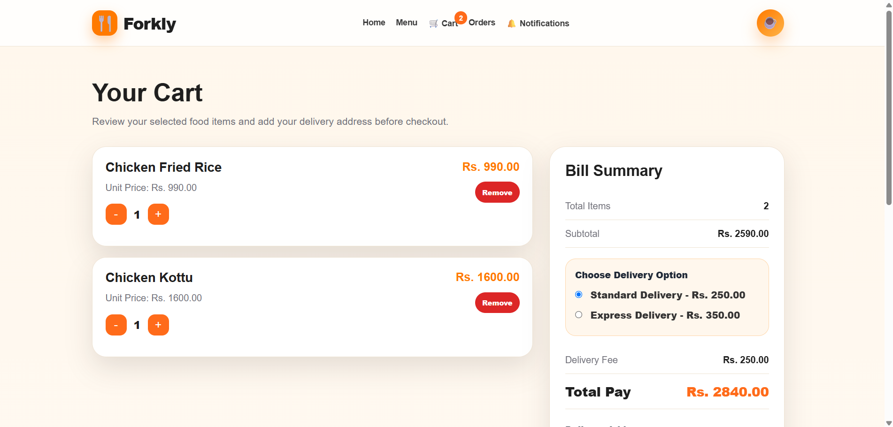
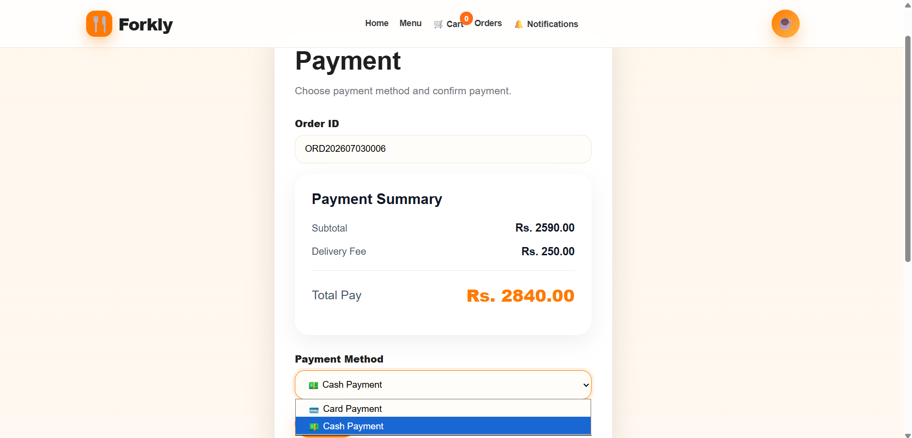
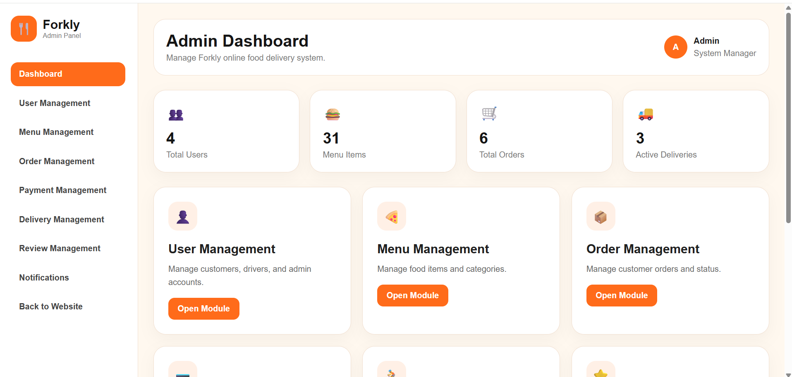
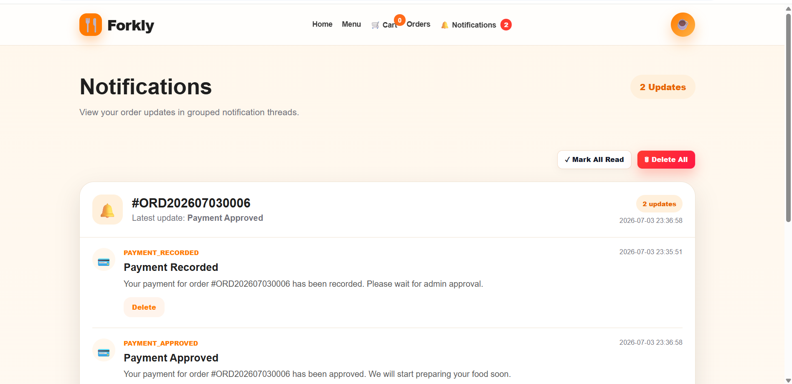
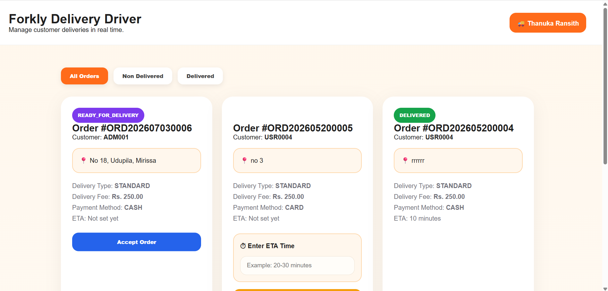

# 🍔 Online Food Delivery System

A full-stack web application developed as a university team project to simplify the online food ordering process. The system allows customers to browse menus, place orders, make payments, track deliveries, and receive real-time notifications, while administrators and delivery personnel can efficiently manage the entire workflow.

## 📌 Project Overview

This application was developed by a team of **6 members** as part of a Software Engineering project. The goal was to build a complete online food delivery platform using Java web technologies while following software engineering principles and collaborative development practices.

## ✨ Features

### 👤 Customer

* User Registration & Login
* Browse Food Menu
* Add Items to Cart
* Place Orders
* Online Payment
* Order History
* Delivery Tracking
* Notifications

### 👨‍💼 Administrator

* Dashboard
* Manage Menu Items
* Manage Orders
* Approve Payments
* Manage Customers
* Monitor Deliveries

### 🚚 Delivery Staff

* View Assigned Deliveries
* Update Delivery Status
* Update Estimated Delivery Time (ETA)

## 🛠️ Technology Stack

### Frontend

* HTML5
* CSS3
* JavaScript
* JSP

### Backend

* Java
* Java Servlets

### Database

* File-based Storage (Project Implementation)

### Tools

* Git
* GitHub
* IntelliJ IDEA

## 📂 Project Structure

src/
│
├── model/
├── service/
├── servlet/
├── utils/
│
webapp/
│
├── client/
├── admin/
├── driver/
├── css/
├── js/
└── assets/

## 📸 Screenshots

### Home Page

### Login

### Menu

### Order 

### Cart 

### Payment

### Admin Dashboard

### Notification

### Delivery Driver's Dashboard

## 📈 Future Improvements

* Online payment gateway integration
* Email notifications
* SMS notifications
* Google Maps integration
* AI-based food recommendations
* Mobile application

---

## 🤝 Team Project

This project was completed collaboratively by a team of **6 members**. Each member contributed to different modules of the application. 
